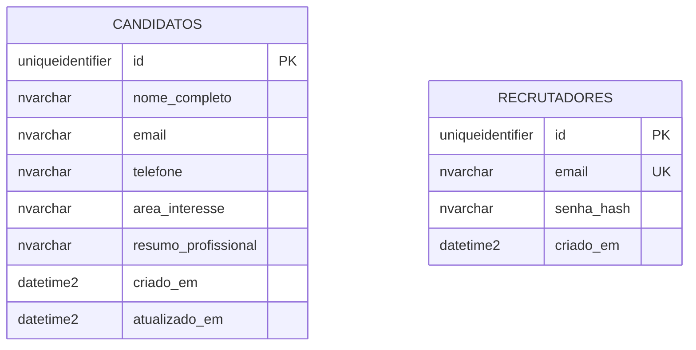

# Diagrama entidade-relacionamento

## Regras

- `candidatos` guarda somente informações confirmadas no cadastro; identificador UUID e datas UTC.
- Nome e e-mail são obrigatórios; campos restantes opcionais. O arquivo PDF não é armazenado.
- `recrutadores` contém somente identidade local e hash Argon2id. Não há cadastro público nem relação automática entre conta e candidato.
- Em `STORAGE_MODE=memory`, essas operações são simuladas em memória e não geram persistência SQL.
- Auditoria técnica permanece nos arquivos JSONL diários, sem dados pessoais.
